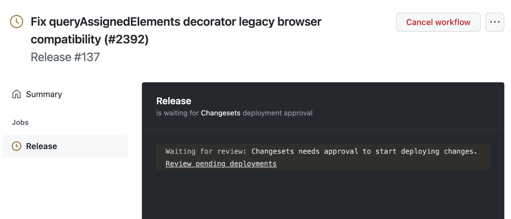
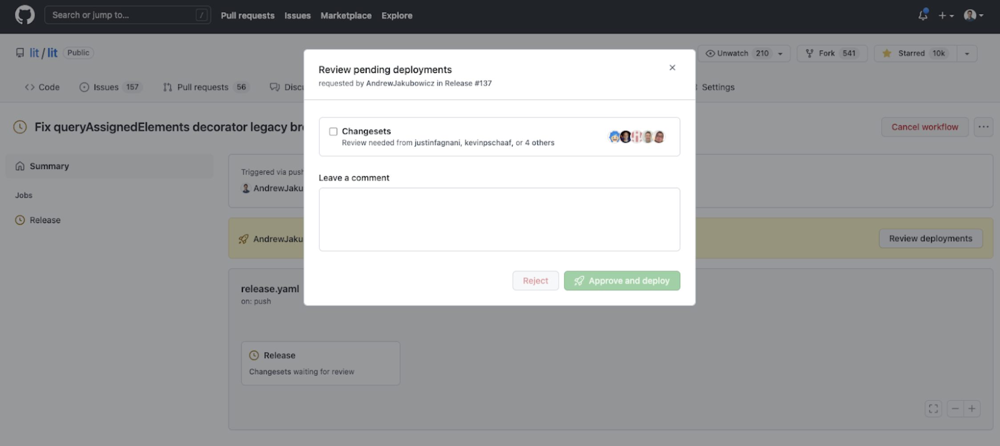
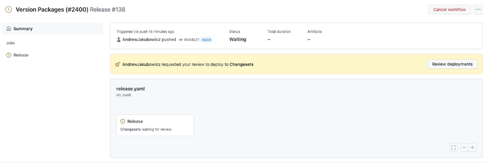
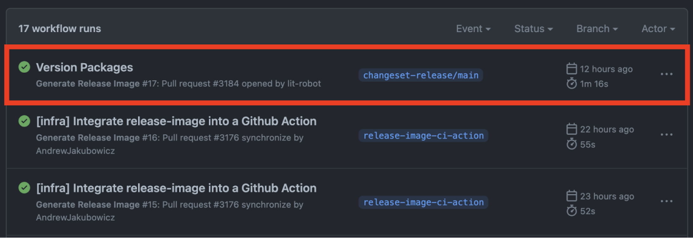

# Lit release process

Audience: Lit core contributors.

## Objective

The end result of this document is a release of all unreleased changes on the main branch for all packages in the Lit monorepo.

> **Note**
> Before releasing, ensure the main branch has been imported and tested within Google. Because Google has an unversioned monorepo, this provides confidence we are not releasing unexpected breaking changes. This can be checked by pinging the general development channel on [our Discord](https://discord.com/invite/buildWithLit).

### Tl;dr

1. Approve "Release / Release" GitHub action on the latest commit to release.
1. Code review the automatically created "Version Packages" PR.
1. Squash and merge the "Version Packages" PR.
1. Approve the "Release / Release" workflow on the commit created by "Version Packages" PR. This publishes the new releases to NPM and GitHub.

## Process

1. Find the [commit you want to release](https://github.com/lit/lit/commits/main), and click on the yellow dot (or red cross) that represents GitHub Action checks. There should be a pending Github Action called "Release / Release (push)". Click "Details".



2. Click on the link "Review pending deployments" which will navigate you to a GitHub Action page for the Release workflow. Then click "Review deployments" and approve the pending deployment.




3. The GitHub release action will now automatically generate a "Version Packages" PR.

> **Warning**
> If a Version Packages pull request has not been created, an error may have occurred in the GitHub action run. Look at the full logs for root cause.
>
> Possible failures previously encountered: A malformed changest file referencing a package name that doesn't exist.
> The fix was to commit the fixed changeset file to main, and re-run the release process on that new commit with the fixed changeset.


4. Request code reviews from members of the team familiar with the packages that will be released.

   1. The purpose of this pull request is to:
      1. Delete all the changeset files, moving their contents into the various Changelog files.
      1. Bump the versions global.
      1. Bump version numbers in package.json files.
      1. Bump dependency ranges in related package.json files if needed. (Only expected in minor or major releases).
   1. Errors to look for:
      1. When a new package is created and released, it is easy to accidentally have the version in the package.json set to version 1.0.0, resulting in Changeset bumping the version to 2.0.0. Fix is to create the package at version 0.0.0.
      1. Major version releases or minor features may require further scrutiny as major releases mark major events and require coordination.
      1. Changelog updates to `lit` core libraries such as `lit-html`, `lit-element`, and `@lit/reactive-element` should be relected in the umbrella `lit` package.
      1. Internal private or not ready to be released packages should not get changelogs or version bumps.
   1. Fix errors by closing the automated "Version Packages" pull request. Commit changes to `main` branch and re-run the release process.

5. Once "Version packages" is approved, (provided no new changesets were merged to `main` in the meantime), squash and merge.

> **Warning**
> If a commit to `main` occurred while the "Version Packages" PR was open and a new changeset was created then do not squash and merge.
> Instead re-run version packages to update the PR with the most recent changes. Otherwise the following steps will not publish a release and will instead create another "Version Packages" PR integrating the new changeset file.
>
> A publish only occurs when there are no unreleased changeset files on `main`.

6. The process to publish to NPM and create a GitHub release follows the same process as before. Find the "Version Packages" commit and wait for at least `tests-local` to pass. Then repeat steps 1. and 2. from above, where this time the result of approving the "Release / Release" GitHub Action is publishing a new NPM version release and GitHub release.





7. Check for the [new release notes](https://github.com/lit/lit/releases), and check https://www.npmjs.com to confirm the publish to NPM. Congratulations you've released Lit.

# Processes to follow after a release

## Updating Lit.dev generated docs

If the release contains new API documentation then [lit.dev](https://lit.dev) will need to be updated.

1. Copy the release commit sha.
2. Navigate to [lit-dev-tools-cjs/src/api-docs/configs/lit-2.ts](https://github.com/lit/lit.dev/blob/7da810ec1e0a77ddea516cad3a5c9f166ce718c1/packages/lit-dev-tools-cjs/src/api-docs/configs/lit-2.ts#L24)
3. Replace the previous sha with the new sha.
4. Re-build Lit.dev with `npm run build`. When the build succeeds `pages.json` and/or `symbols.json` will contain the new documentation. If these files have not been updated then no API docs have changed.
5. Commit these changes to the lit.dev repo. [Example pull request](https://github.com/lit/lit.dev/pull/692).

## Communication

Announce the new release on Twitter and Discord!

## Generating release image

### Getting release image automatically

A release image is automatically generated when the "Version Packages" pull request is created by the "Generate Release Image" action.

1. Navigate to https://github.com/lit/lit/actions/workflows/release-image.yaml



2. Click on the top workflow (highlighted by a red border in the image), and find the artifact zip file.


3. The releaseimage zip file contains the release image.

### Generating the release image manually

_Use this option to create multiple images or want to render out some custom markdown._

> **Note**
> Usage of `release-image` tool can be checked by invoking the command with no arguments.

Run each of the commands below from the `lit` monorepo root. Each generates a `release.png`.

#### Create an iamge for many versions of the same package

```sh
cd packages/internal-scripts && npm run build && npx release-image \
-f ../lit-html/CHANGELOG.md -v 2.0.1 \
-f ../lit-html/CHANGELOG.md -v 2.0.0
```

#### Create an image from a markdown file

Given the following markdown file:

```md
<!-- release.md -->

# Custom Release Notes

Custom content in **here**.
```

Executing `cd packages/internal-scripts && npm run build && npx release-image -m release.md` gives:


